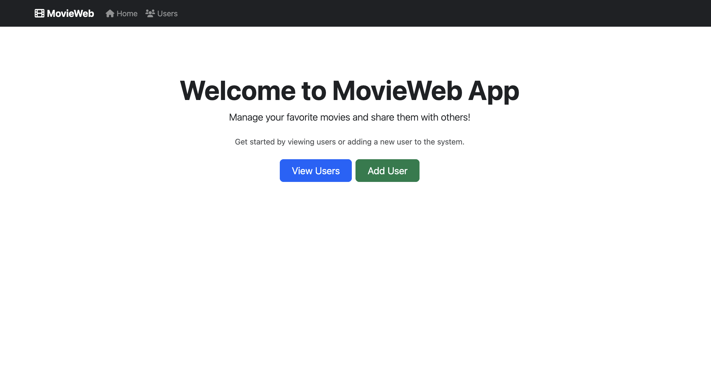
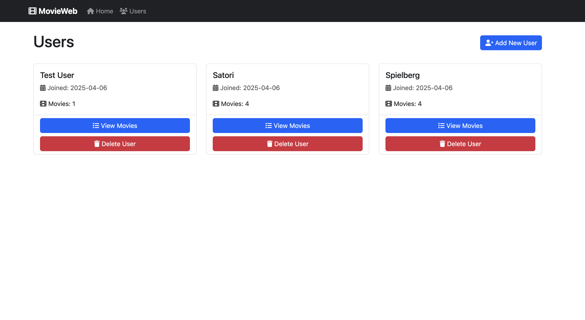
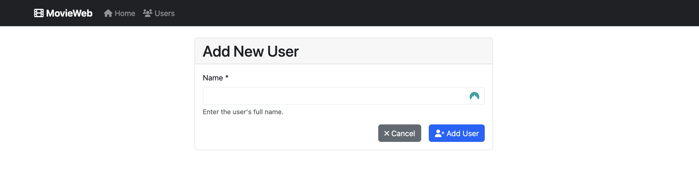
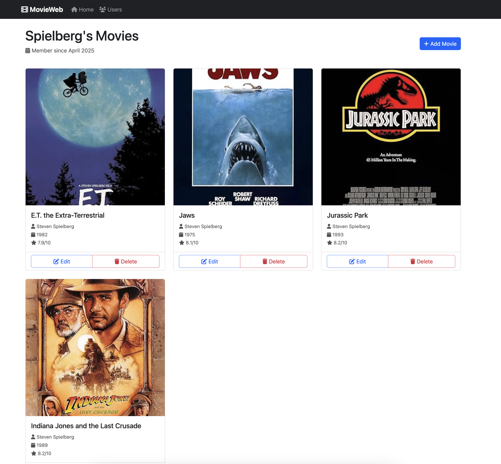
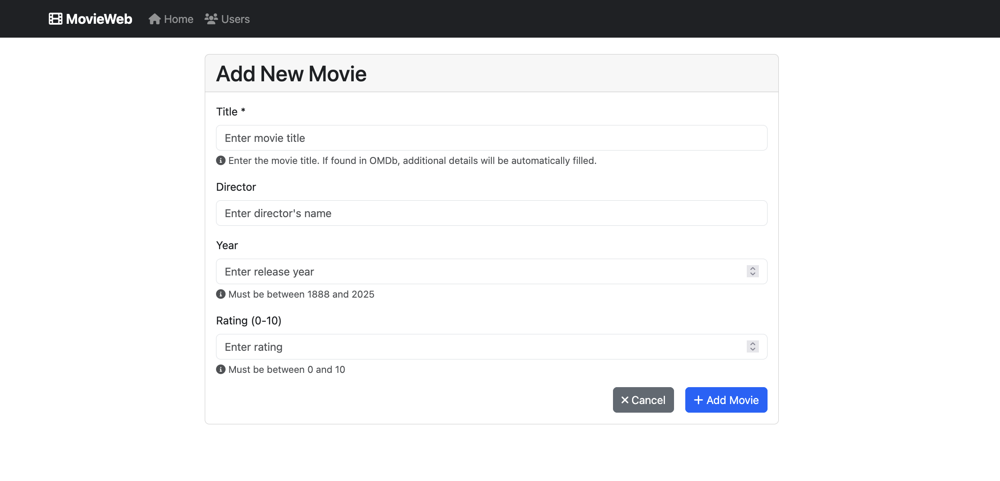

# MovieWeb App

A Flask-based web application for managing user movie collections. This project demonstrates proficiency in Python, Flask, SQLAlchemy, and web development.

## Features

- ✅ User Management
  - Add new users
  - View all users
  - View user-specific movie collections

- ✅ Movie Management
  - Add movies with automatic OMDb data fetching
  - Update movie details
  - Delete movies
  - View movie posters
  - Rate movies (0-10 scale)

- ✅ Technical Features
  - SQLite database integration
  - OMDb API integration for movie data
  - Responsive Bootstrap UI
  - Error handling and user feedback
  - Clean MVC architecture

## Project Structure

```
movie_project_final_phase/
├── app/                    # Main application package
│   ├── templates/         # HTML templates
│   ├── models/            # Database models
│   ├── views/             # View functions and routes
│   ├── controllers/       # Business logic and data manipulation
│   ├── services/          # External service integrations
│   └── __init__.py        # App initialization
├── tests/                 # Test files
├── config/                # Configuration files
├── requirements.txt       # Project dependencies
└── README.md             # Project documentation
```

## Setup and Installation

1. Clone the repository
2. Create a virtual environment:
   ```bash
   python -m venv venv
   source venv/bin/activate  # On Windows: venv\Scripts\activate
   ```
3. Install dependencies:
   ```bash
   pip install -r requirements.txt
   ```
4. Set up environment variables in `.env`:
   ```
   FLASK_APP=app
   FLASK_ENV=development
   OMDB_API_KEY=your_api_key_here
   OMDB_API_URL=http://www.omdbapi.com/
   ```
5. Initialize the database:
   ```bash
   python init_db.py
   ```
6. Run the application:
   ```bash
   flask run
   ```

## Usage

1. Access the application at `http://localhost:5000`
2. Add a new user through the "Add User" page
3. View the user's movies and add new ones
4. When adding a movie:
   - Enter the movie title
   - The app will automatically fetch data from OMDb
   - You can manually edit the details if needed
5. Manage your movie collection:
   - Update movie details
   - Delete movies
   - View movie posters

## Development

### Running Tests
```bash
pytest tests/ -v  # Run all tests
pytest tests/ --cov=app  # Run tests with coverage
```

### Code Quality
```bash
black .  # Format code
flake8 .  # Lint code
```

## Contributing

1. Fork the repository
2. Create a feature branch
3. Commit your changes
4. Push to the branch
5. Create a Pull Request

## License

This project is licensed under the MIT License - see the LICENSE file for details.

## 📸 Screenshots

### Home Page

*The welcoming home page of MoviWeb App*

### Users Management

*View and manage all users in the system*

### Add New User

*Form to add a new user to the system*

### User's Movies

*View and manage a user's movie collection*

### Add New Movie

*Form to add a new movie to a user's collection*

## 🔑 Key Components

- **DataManager Interface**: Abstract base class for data management
- **SQLiteDataManager**: Implementation for SQLite database operations
- **OMDbService**: Service for fetching movie data from OMDb API
- **RESTful Routes**: Well-structured API endpoints for CRUD operations
- **Error Handling**: Comprehensive error handling and user feedback

## 🚀 Getting Started

1. Clone the repository
2. Install dependencies: `pip install -r requirements.txt`
3. Set up environment variables in `.env`
4. Initialize the database: `python init_db.py`
5. Run the application: `python app.py`

## 📚 Learning Outcomes

This project demonstrates:
- Web application development with Flask
- Database design and implementation
- API integration
- Error handling and testing
- Clean code architecture
- User interface design

## 🔒 Security

- Environment variables for sensitive data
- Input validation and sanitization
- Secure database operations
- Error handling without exposing sensitive information

## 📝 License

This project is licensed under the MIT License - see the LICENSE file for details.